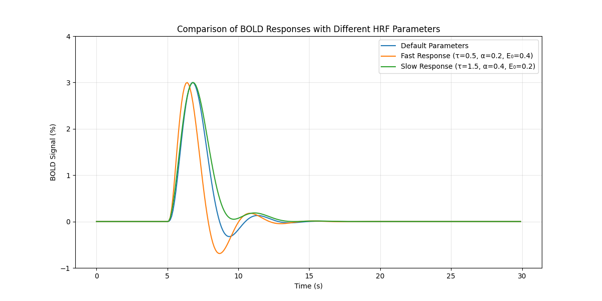
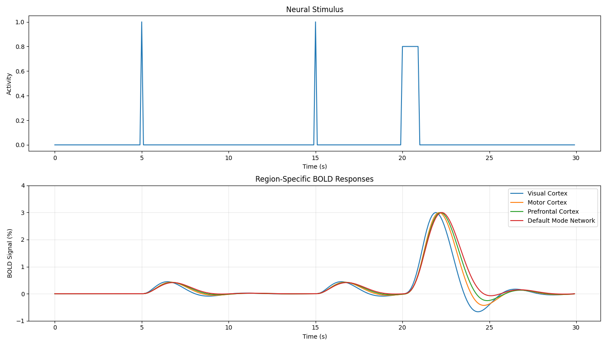

# Personalized HRF in Computational Models of fMRI Activity

[](https://opensource.org/licenses/MIT)
[](https://www.python.org/downloads/)

This project implements personalized hemodynamic response functions (HRF) for computational models of fMRI activity, specifically targeting integration with The Virtual Brain (TVB) platform.



## Overview

The hemodynamic response function (HRF) describes the relationship between neural activity and the Blood Oxygen Level Dependent (BOLD) signal measured in fMRI. The standard approach uses a canonical HRF that is the same across all brain regions and subjects. However, research shows that the HRF varies across brain regions, subjects, and conditions.

This project provides tools to:

1. Estimate personalized HRF parameters from empirical fMRI data
2. Implement the Balloon-Windkessel model with personalized parameters
3. Integrate personalized HRFs into The Virtual Brain simulations
4. Visualize and analyze HRF parameters and simulation results

## Core Components

- **Balloon-Windkessel Model**: Implementation of the standard model converting neural activity to BOLD signals
- **Personalized HRF**: Extension of the Balloon-Windkessel model with region-specific parameters
- **HRF Estimation**: Tools for estimating HRF parameters from empirical fMRI data
- **TVB Integration**: Classes for integrating the personalized HRF model with TVB
- **Visualization**: Utilities for visualizing HRF parameters and simulation results

## Project Structure

```
fmri_project/
├── src/                        # Source code
│   ├── models/                 # Model implementations
│   │   ├── hrf_generator.py    # HRF generation algorithms
│   │   └── verify_balloon_model.py # Validation of Balloon-Windkessel
│   └── utils/                  # Utility functions
├── docs/                       # Documentation
│   ├── presentations/          # Presentation materials
│   │   └── presentation.html   # Presentation on personalized HRF
│   └── PROJECT_SUMMARY.md      # Project summary document
├── examples/                   # Examples and demos
│   ├── demo.py                 # Basic demonstration
│   ├── hrf_estimation_demo.py  # Parameter estimation demo
│   ├── simple_demo.py          # Simplified example
│   └── synthetic_bold.py       # BOLD signal simulation
├── tests/                      # Test files
│   └── test_basic.py           # Basic tests
├── images/                     # Images and figures
│   ├── basic_hrf_demo_new.png  # Basic HRF visualization
│   ├── hrf_parameter_comparison_new.png # Parameter comparison
│   ├── parameter_estimation_demo_new.png # Estimation workflow
│   └── regional_variability_demo_new.png # Regional variance demo
├── .gitignore                  # Git ignore file
├── LICENSE                     # MIT License (MIT)
├── README.md                   # This file
├── requirements.txt            # Python dependencies
└── setup.py                    # Package setup
```

## Installation

### Prerequisites

- Python 3.8+
- NumPy
- SciPy
- Matplotlib
- (Optional) The Virtual Brain for integration features

### Basic Installation

```bash
# Clone the repository
git clone https://github.com/demiregeortac/personalized-hrf-fmri.git
cd personalized-hrf-fmri

# Install the package
pip install -e .
```

### With TVB Support (optional)

```bash
pip install -e ".[tvb]"
```

### Development Installation

```bash
pip install -e ".[dev]"
```

## Demonstration Scripts

The project includes several demonstration scripts to showcase its functionality:

### 1. Basic Demonstration (`examples/demo.py`)

This script demonstrates:
- Creating a standard Balloon-Windkessel model
- Creating a personalized HRF model
- Simulating and comparing BOLD responses

```bash
python examples/demo.py
```

### 2. HRF Estimation (`examples/hrf_estimation_demo.py`)

This script demonstrates:
- Generating synthetic fMRI data
- Estimating the HRF parameters from the data
- Comparing the estimated parameters with the ground truth
- Validating the estimates by simulating BOLD responses

```bash
python examples/hrf_estimation_demo.py
```

## Testing

Basic tests are included to verify the implementation:

```bash
python tests/test_basic.py
```

## Documentation

For a more detailed overview of the project, including technical details, implementation status, and next steps, see the [docs/PROJECT_SUMMARY.md](docs/PROJECT_SUMMARY.md) document.

## Results and Visualizations



The project includes various visualizations to demonstrate the impact of personalized HRF modeling on fMRI analysis.

## References

1. Friston, K.J., et al. (2000). Nonlinear responses in fMRI: the Balloon model, Volterra kernels, and other hemodynamics. Neuroimage 12, 466-477.
2. Stephan, K.E., et al. (2007). Comparing hemodynamic models with DCM. Neuroimage 38, 387-401.
3. Wu, G-R., et al. (2021). rsHRF: A Toolbox for Resting-State HRF Estimation and Deconvolution. Neuroimage.
4. Sanz-Leon, P., et al. (2015). The Virtual Brain: a simulator of primate brain network dynamics. Frontiers in Neuroinformatics 9, 79.

## License

This project is licensed under the MIT License - see the [LICENSE](LICENSE) file for details.

## Author

* **Demir Ege Ortaç** - [GitHub Profile](https://github.com/demiregeortac666)

## Acknowledgements

- Friston, K.J., et al. (2000). Nonlinear responses in fMRI: the Balloon model, Volterra kernels, and other hemodynamics. Neuroimage 12, 466-477.
- Stephan, K.E., et al. (2007). Comparing hemodynamic models with DCM. Neuroimage 38, 387-401.
- The Virtual Brain Project (https://www.thevirtualbrain.org/)
- rsHRF Toolbox (https://www.nitrc.org/projects/rshrf)
